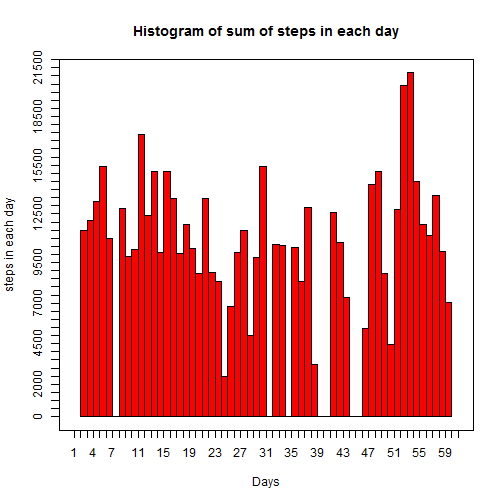

# Reproducible Research: Peer Assessment 1

The assignment includes the analysis of various parameters of Activity Monitoring Data.

## Loading and preprocessing the data
This chunk of code includes loading of data. 
The data is read into a variable called 'doc'


```r
doc <- read.csv("activity.csv")
```


## What is mean total number of steps taken per day?

This chunk of code calculates the total number of steps taken every day and draws mean and median for that data.

consider the date column of the doc variable. convert that into numeric which will represent each date as a sequence of numbers.

```r
doc$dates <- as.numeric(doc$date)
```

In this case 01-10-2012 is represented as 1, 02-10-2012 as 2, and so on.
So finally, total number of days is 61.

```r
length(doc$dates)
```

```
## [1] 17568
```


Split the column 'Steps' by each date and calculate the sum of steps for each date.

```r
repetitions <- sapply(split(doc$steps, doc$dates), function(x) sum(x, na.rm = TRUE))
```


Repeate each date as number of times a the sum of steps and then draw the histogram.


```r
hist(rep(as.numeric(names(repetitions)), repetitions), xlab = "Days", ylab = "steps in each day", 
    main = "Histogram of sum of steps in each day", col = "red", xlim = c(1, 
        61), breaks = 61, axes = FALSE)
axis(1, seq(1, 61, 1))
axis(2, seq(0, 22000, 500))
box()
```

 

Finally calculate the mean and median of the sum of steps.

```r
mean1 <- mean(repetitions)
median1 <- median(repetitions)
mean1
```

```
## [1] 9354
```

```r
median1
```

```
## [1] 10395
```


## What is the average daily activity pattern?

This chunk of code deals with average number of steps in various time intervals and calculate the maximum average number of steps.

Split the steps based on different time intervals and calculate its mean.
Now, plot the steps and interval with type l.


```r
avgSteps <- sapply(split(doc$steps, doc$interval), function(x) mean(x, na.rm = TRUE))

plot(as.numeric(names(avgSteps)), as.numeric(avgSteps), xlab = " 5-minute interval", 
    ylab = "average number of steps taken across all days", main = "interval vs number of steps", 
    type = "l")
```

 


time interval with the maximum average number of steps is as follows:

```r
maxVal <- max(avgSteps)
names(avgSteps[avgSteps == maxVal])
```

```
## [1] "835"
```


## Imputing missing values

This chunk of code deals with missing values. 

The total number of missing values in the dataset can be counted by

```r
nrow(doc[!complete.cases(doc), ])
```

```
## [1] 2304
```

These missing values are filled with mean of that 5-minute interval across all dates. This is stored in another variable doc1.

First, the average number of steps for each 5-minute interval is calculated and stored in variable intervalMean. The indices of the missing values are noted and the corresponding 5-minute intervals are extracted. For the extracted 5-minute intervals vector, a new vector is created which is filled with the average values of that correspoding 5-minute interval. This vector is filled in the corresponding missing indices of Steps.

```r
doc1 <- doc
intervalMean <- sapply(split(doc1$steps, doc1$interval), function(x) mean(x, 
    na.rm = TRUE))
index <- which(is.na(doc1$steps), arr.ind = TRUE)

intervalIndices <- doc1$interval[index]
imputeValues <- sapply(intervalIndices, function(x) {
    intervalMean[names(intervalMean) == x]
})
for (i in 1:length(index)) {
    doc1$steps[index[i]] <- imputeValues[i]
}
```


Now if we plot the histogram for total number of steps for each day. The plot may look as follows:


```r
repetitions1 <- sapply(split(doc1$steps, doc1$dates), function(x) sum(x, na.rm = TRUE))
hist(rep(as.numeric(names(repetitions1)), repetitions1), xlab = "Days", ylab = "steps in each day", 
    main = "Histogram of sum of steps in each day", col = "red", xlim = c(1, 
        61), breaks = 61, axes = FALSE)
axis(1, seq(1, 61, 1))
axis(2, seq(0, 22000, 500))
box()
```

 


Now if we calculte the mean and median for the new set of total number of steps in each day.


```r
mean2 <- mean(repetitions1)
median2 <- median(repetitions1)
mean2
```

```
## [1] 10766
```

```r
median2
```

```
## [1] 10766
```


Now, if we can notice, the mean of total number of steps in each day for the new set 1.0766 &times; 10<sup>4</sup> and for old data 9354.2295 differes a lot. That is even reflected for median, i.e the values of median for new data 1.0766 &times; 10<sup>4</sup> is higher than that of old data10395.

As we have ignored the missing values previously, hence the values of mean and median are less than the case where we have imputed the missing values.


## Are there differences in activity patterns between weekdays and weekends?

Each day is classified as weekday or weekend. Then get the distribution of time-interval and average number of steps for each class (i.e., weekday, weekend).

A column named 'weekday' is created, which gives information if a day is a weekday or a weekend.


```r
doc1$weekday <- sapply(weekdays(as.Date(doc$date)), function(x) if (x == "Sunday" | 
    x == "Saturday") return("weekend") else return("weekday"))
```


Now, consider two variables weekdayDoc and weekendDoc, which includes the entire information regarding weekdays and weekends respectively.


```r
weekdayDoc <- doc1[doc1$weekday == "weekday", ]
weekendDoc <- doc1[doc1$weekday == "weekend", ]
```


Now, plot the graph which includes the distribution of average number of steps taken for each time interval across weekdays and weekends seperately.

```r
par(mfrow = c(2, 1))
weekendAvgSteps <- sapply(split(weekendDoc$steps, weekendDoc$interval), function(x) mean(x, 
    na.rm = TRUE))

plot(as.numeric(names(weekendAvgSteps)), as.numeric(weekendAvgSteps), main = "weekend", 
    xlab = "interval", ylab = "Number of steps", type = "l", col = "blue")

weekdayAvgSteps <- sapply(split(weekdayDoc$steps, weekdayDoc$interval), function(x) mean(x, 
    na.rm = TRUE))

plot(as.numeric(names(weekdayAvgSteps)), as.numeric(weekdayAvgSteps), main = "weekday", 
    xlab = "interval", ylab = "Number of steps", type = "l", col = "blue")
```

 

